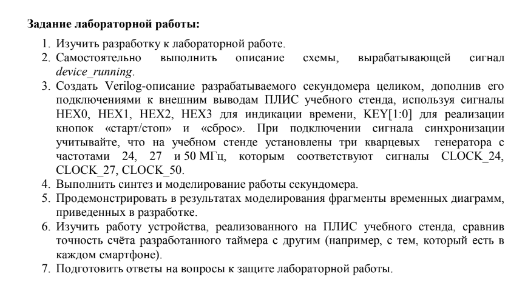

# Лабораторная работа № 5, "Секундомер"  
  
## Задание 2  
[Device_running_ctrl.v](src/Device_running_ctrl.v)  

## Задание 3
[stopwatch.v](src/stopwatch.v)  
Для отлаживания программы использовался тактовый импульс с периодом 500ns, 3-ичная система исчисления и допущение, что в 0.01 сек 3 тактовых имульса.  
