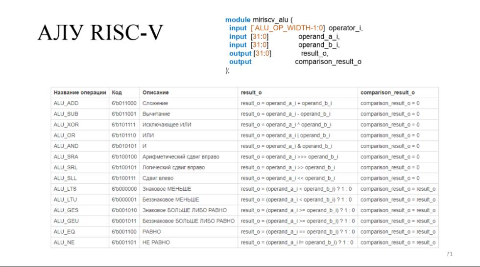

# Лабораторная работа № 1, "Verilog HDL. АЛУ."  
  
Вся презентация для ЛР 1 доступна [тут](https://drive.google.com/file/d/1qmmbdWXvjalsUUMOXn2I_4a42hmnYLrs/view?usp=sharing).
## Код модуля
[miriscv_alu.v](miriscv_alu.v)  

## Код тестов
[alu_tb.v](alu_tb.v)  
